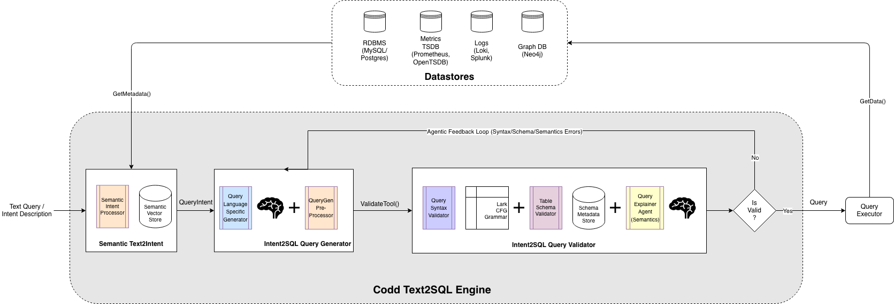

# Codd Text2SQL Engine

## Overview

Codd is a Text2SQL Engine that can be used by AI Coding Agents (Claude Code, Codex, Cursor) to query Databases (MySQL, Postgres, Neo4j etc) and Observability systems (Prometheus, Loki, Splunk etc).

It is named after the computer scientist [Edward F Codd](https://en.wikipedia.org/wiki/Edgar_F._Codd), who created the Relational model that underpins all SQL databases. Codd Query Engine works for both SQL and non-SQL query languages

## Architecture

Codd Text2SQL Engine Architecture is an extension of a previous Hackday Text2SQL project by the authors called [Maverick](https://github.com/sathish316/maverick) and inspired by other Text2SQL Engines in the industry like [Uber QueryGPT](https://www.uber.com/en-IN/blog/query-gpt/), [Flipkart PlatoAI](https://blog.flipkart.tech/plato-ai-revolutionising-flipkarts-data-interaction-with-natural-language-081644ac6b16) etc.



## Usecases

Codd Text2SQL Engine can be used for the following usecases:
- Querying Metrics and troubleshooting Oncall/Production issues from Coding Agents or other Agents
- Querying Logs and troubleshooting Oncall/Production issues from Coding Agents or other Agents
- Querying Relational databases using Natural language
- Querying Graph databases using Natural language

See the companion repo [Codd AgentSkills Examples](https://github.com/sathish316/codd_agentskills_examples) for more details on how to use Codd as a Skill or MCP server.

## MCP Tools

**Codd Tools:**
| Tool | Description |
|------|-------------|
| `search_relevant_metrics` | Semantic search to find metrics relevant to a problem or textual query description |
| `construct_promql_query` | Generate valid PromQL query from metrics query intent |
| `construct_logql_query` | Generate valid LogQL query for Loki from log query intent |
| `construct_splunk_query` | Generate valid Splunk SPL query from log query intent |

## Getting started with Codd using AgentSkills

AgentSkills is a portable standard released by Anthropic for packaging AI Skills as a combination of Prompt, Resources, Scripts, MCP servers - https://agentskills.io/home. It is supported by Claude Code, Codex CLI, Cursor etc.

To use Codd as a Skill from Claude Code and other Coding agents, see the companion repo [Codd AgentSkills Examples](https://github.com/sathish316/codd_agentskills_examples) for examples:
- [Using Codd Skills for Metrics analysis](https://github.com/sathish316/codd_agentskills_examples/blob/main/doc/USING_MAVERICK_SKILLS_FROM_CLAUDE_CODE_FOR_METRICS_AND_LOGS_ANALYSIS.md)
- [Using Codd Skills for Logs analysis](https://github.com/sathish316/codd_agentskills_examples/blob/main/doc/USING_MAVERICK_SKILLS_FROM_CLAUDE_CODE_FOR_METRICS_AND_LOGS_ANALYSIS.md)
- Using Codd Skills for Database queries #TOLINK

LogAnalyzer skill demo - https://youtu.be/T9wKbCRUHMI

<p align="center">
  <a href="https://youtu.be/T9wKbCRUHMI">
    
  </a>
</p>

MetricAnalyzer skill demo - https://youtu.be/U9SqFeNSITk

<p align="center">
  <a href="https://youtu.be/U9SqFeNSITk">
    
  </a>
</p>

## Getting started with Codd using MCP

Add the following to your `mcp.json` file in Cursor or ClaudeCode or any AI app that supports MCP:

```json
{
    "mcpServers": {
        "codd": {
            "command": "uv",
            "args": [
                "run",
                "--directory",
                "/path/to/codd_query_engine",
                "python",
                "-m",
                "codd_mcp_server.server"
            ],
            "env": {
                "PYTHONPATH": "/path/to/codd_query_engine"
            }
        }
    }
}
```

Once Codd MCP server is added, see the following docs for examples:
- [Using Codd MCP server for Metrics analysis](https://github.com/sathish316/codd_agentskills_examples/blob/main/doc/USING_MAVERICK_MCP_FROM_CURSOR_FOR_METRICS_AND_LOGS_ANALYSIS.md)
- [Using Codd MCP server for Logs analysis](https://github.com/sathish316/codd_agentskills_examples/blob/main/doc/USING_MAVERICK_MCP_FROM_CURSOR_FOR_METRICS_AND_LOGS_ANALYSIS.md)
- Using Codd MCP server for Database queries #TOLINK

## Installation

1. Prerequisites

Codd uses Redis for storing Schema metadata and a Vector database (ChromaDB) for storing Semantic metadata. Redis and ChromaDB can be installed using Docker compose

```bash
$ docker-compose up -d
```

2. API tokens for LLM providers

Codd uses OpenAI or Anthropic API tokens for LLM providers. Set any of these environment variables:
- OPENAI_API_KEY
- ANTHROPIC_API_KEY

To use Codd with OpenRouter or custom AI Gateways, please refer to the HOW-TOs

3. Initialize config

Setup codd config file for Text2SQL generation options and customizing the options:

```bash
# setup codd config for MCP
mkdir -p ~/.codd
cp codd_engine/config/config.sample.yml ~/.codd/config.yml
cp -r codd_engine/prompts ~/.codd/

# setup codd config for Tests/Evals
mkdir -p ~/.codd_test
cp tests/config/config.test.yml ~/.codd_test/config.yml
```

4. Install dependencies

Codd uses uv for package management. Install dependencies using uv

```bash
uv sync
```

It additionally uses [Opus Agents](https://github.com/sathish316/opus_agents) for Agentic capabilities. Install Opus Agents before proceeding. TOFIX - this step will be replaced with a direct PyPi installation.

```bash
# Setup opus_agents in a sibling director of codd
cd ../

# build opus_agents
git clone git@github.com:sathish316/opus_agents.git
cd opus_agents
uv sync
uv run python -m build opus_agent_base

# add opus_agents dependency to codd_query_engine
cd ../codd_query_engine
uv sync
```

5. Run tests

Codd query engine comes with several comprehensive unit, integration, eval tests to ensure the quality of Text2SQL generation. Before using Codd be sure to run atleast a subset of these tests:

```bash
# run unit tests
uv run pytest
# or
uv run python -m pytest

# run PromQL query generation tests to verify E2E generation
uv run pytest -m integration_querygen_evals "tests/integration/evals/test_promql_querygen_evals_integration.py::TestPromQLQueryGenEvalsIntegration::test_promql_query_generation_scenarios[scenario_1_counter_with_rate]" -s -v --log-cli-level=INFO
```

6. Start Codd Service

Codd MCP server uses a REST service for Query generation. Start the service using:

```bash
# Start service on default port 2840
uv run uvicorn codd_service.main:app --host 0.0.0.0 --port 2840 --reload

# Optimize the service using uvloop
uv run python -m compileall .
uv pip install uvloop
uv run uvicorn codd_service.main:app --host 0.0.0.0 --port 2840 --loop uvloop
```

Optionally, you can setup AI Observability using [Logfire](https://pydantic.dev/logfire) for the Service. This is essential for development and debugging Query generation.

7. Follow the MCP or AgentSkills guides to use Codd from your favourite AI tools - ClaudeCode or Codex or Cursor.

## Development

Codd Query engine is built using Python, uv, FastAPI, FastMCP, PydanticAI.

To build and test Codd Query engine, run the following commands:
```
# install datastore dependencies
docker-compose up -d

# install dependencies
uv sync

# run unit tests
uv run pytest -v -s

# run integration tests
uv run pytest -v -s -m integration

# run integration tests that make LLM calls
uv run pytest -v -s -m integration_llm
```

## Evals

Codd query engine has a Text2SQL Eval suite to validate the quality of Intent to Query generation. To run evals:

```bash
# run all evals
uv run pytest -m integration_querygen_evals -s -v

# run eval suites for specific query languages
uv run pytest -m integration_querygen_evals tests/integration/evals/test_promql_querygen_evals_integration.py -s -v

uv run pytest -m integration_querygen_evals tests/integration/evals/test_logql_querygen_evals_integration.py -s -v

uv run pytest -m integration_querygen_evals tests/integration/evals/test_spl_querygen_evals_integration.py -s -v
```

See Evals README.md for more details on QueryGen evalsuite.

## Contributing

1. Fork and create a Pull request to contribute features or capabilities

2. Github Issues and Discord Channel can be used for Codd discussions - #TOLINK

3. Companion repo [Codd AgentSkills Examples](https://github.com/sathish316/codd_agentskills_examples) can be used for applications of Codd for Database querying, Metrics/Logs analysis for AI driven Oncall Troubleshooting and more.

## License

MIT License - see the [LICENSE](LICENSE) file for details

